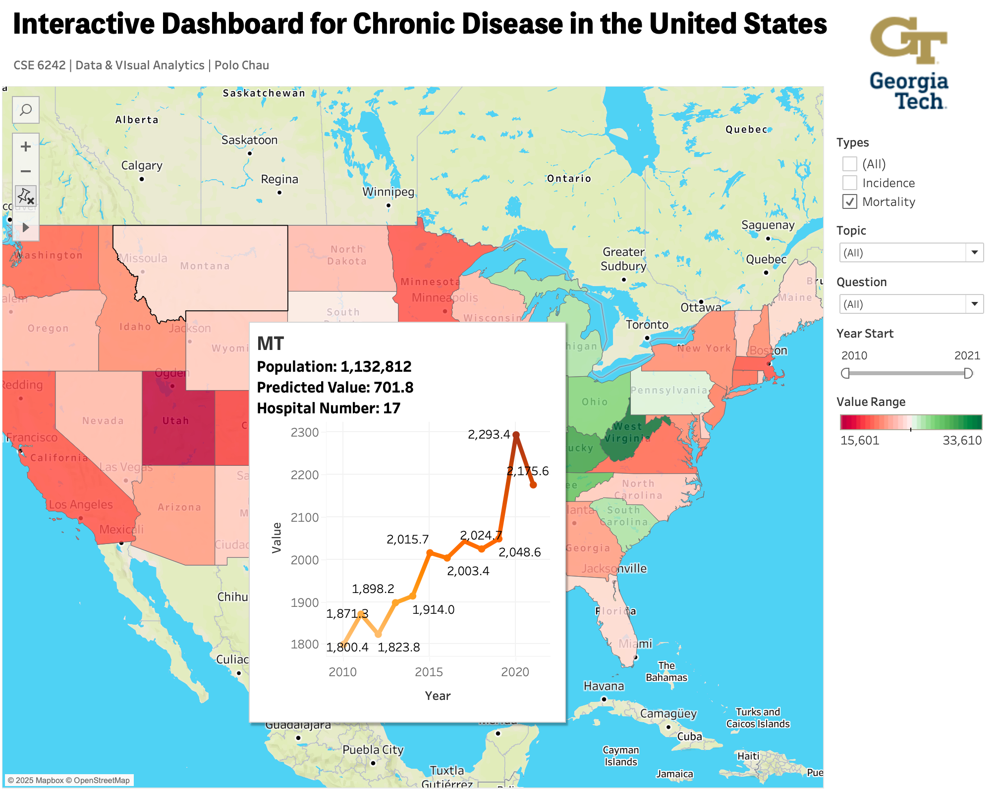

# Interactive Chronic Disease Mapping Using CDC Data
## 📘 Introduction
The project features an interactive map visualizing chronic disease spread across the United States, highlighting regions with significant disease prevalence and mortality. Designed for public health enthusiasts, government agencies, and policymakers, the tool provides state-level data and forecasts to aid in resource allocation, planning, and prevention. Success will be evaluated based on user feedback and the impact of resources on high-risk areas.

## 🗂 Project Structure
```
Interactive-Chronic-Disease-Mapping-Using-CDC-Data/
│
├── 01_data/
│   ├── raw/                        # Original CDC datasets (unchanged)
│   └── processed/                  # Cleaned & transformed datasets
│
├── 02_design/
│   ├── project_planning_slides.pdf # Early-stage design & planning slides
│   └── dashboard_wireframe.rp      # Initial dashboard wireframe (Axure)
│
├── 03_notebooks/
│   ├── 01_data_clean_eda.ipynb
│   ├── 02_exponential_smoothing.ipynb
│   ├── 03_grey_predict.ipynb
│   └── 04_arima_predict.ipynb
│
├── 04_dashboard/
│   ├── dashboard_preview.png       # Dashboard preview screenshot
│   └── dashboard_final.twb         # Tableau workbook
│
├── 05_reports/
│   └── project_poster.png           # Final project poster
│
└── README.md
```

## 📊 Data

The dataset was sourced from the CDC (Centers for Disease Control and Prevention) website (https://data.cdc.gov/). 

Key facts:
	•	359.3MB total size
	•	1,232,801 distinct records
	•	Temporal coverage: 2007–2021
	•	Geographic coverage: All 50 U.S. states
	•	Includes detailed incidence and mortality indicators for multiple chronic diseases.

The dataset provides a rich foundation for time-series forecasting and regional health disparity analysis.


## 🖼 Dashboard Preview

Below is the preview of the interactive Tableau dashboard included in this project:



## 🔧 Methodology

### **1. Data Cleaning**
- Remove missing/invalid entries  
- Standardize column names and formats  
- Process time-series fields  
- Create structured datasets for forecasting  

---

### **2. Forecasting Models**

Implemented and evaluated three modeling approaches:

| Model | Strength |
|-------|----------|
| **Grey Prediction (GM)** | Best overall MAPE; strong with small datasets |
| **Exponential Smoothing** | Good for general time-series trends |
| **ARIMA** | Limited performance due to sparse temporal data |

Grey Prediction provided the most robust results across both mortality and incidence forecasts.

---

### **3. Dashboard Development**

The Tableau dashboard integrates:

- State-level disease incidence & mortality  
- Time-series forecasts  
- Geographic heatmaps  
- Year-based filtering  
- Trend visualization and state comparison  

Users can explore disease trends interactively and assess medical resource needs.

---

## ⭐ Key Insights

- Grey Prediction consistently delivered the **lowest MAPE** for both incidence and mortality.  
- Exponential Smoothing performed well for incidence but less accurate for mortality.  
- ARIMA underperformed due to limited historical data per disease and state.  
- The dashboard improves accessibility and comprehension of complex CDC datasets.  
- Supports policymakers in identifying high-risk populations and planning interventions.
